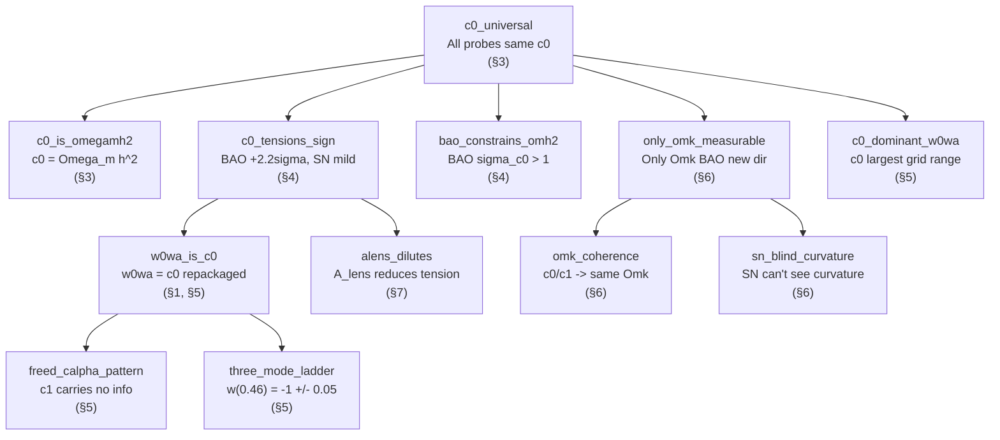

# Claim Dependency Graph

Generated from `\depends{}` annotations in `paper/sections/*.tex`.
Last synced: 2026-03-26.

## Reading the Graph

- **Root:** `c0_universal` -- the fundamental result that all probes share the same c0.
- **Arrows:** A -> B means claim A is a logical prerequisite for claim B.
- **Layer 1 (decomposition):** c0_universal -> c0_is_omegamh2, c0_tensions_sign, bao_constrains_omh2, only_omk_measurable, c0_dominant_w0wa
- **Layer 2 (reinterpretation):** c0_tensions_sign -> w0wa_is_c0, alens_dilutes
- **Layer 3 (w0wa details):** w0wa_is_c0 -> freed_calpha_pattern, three_mode_ladder
- **Layer 3 (curvature):** only_omk_measurable -> omk_coherence, sn_blind_curvature

## Claim count: 12 unique claims across 8 sections
